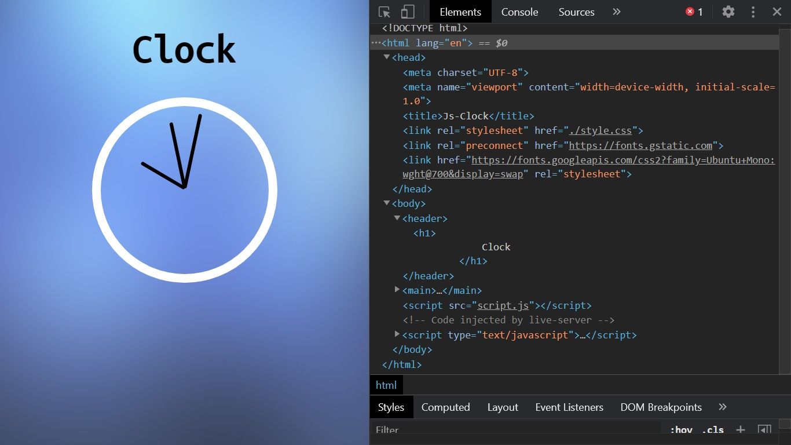

# Javascript Clock

 * ### It's a javascript Clock which takes in the current time using javaScript and updates the clock hands based on the current hour, minute and second.   
 * ### It is fully responsive.   
 * ### To make it look real, an audio is attached which makes a sound similar to original clock.
 

## Screenshot

 
 

